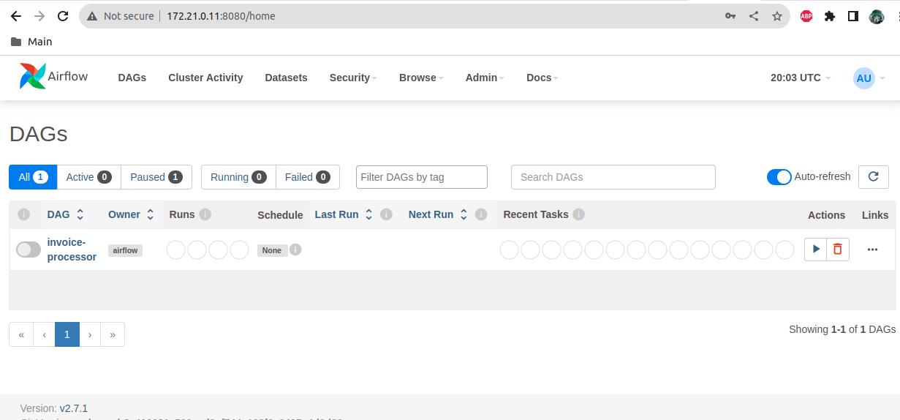
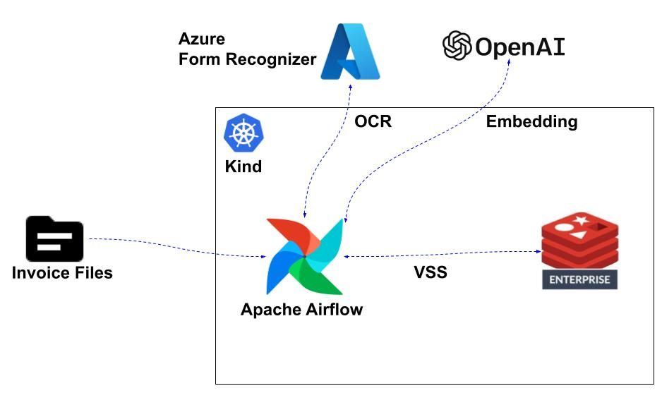
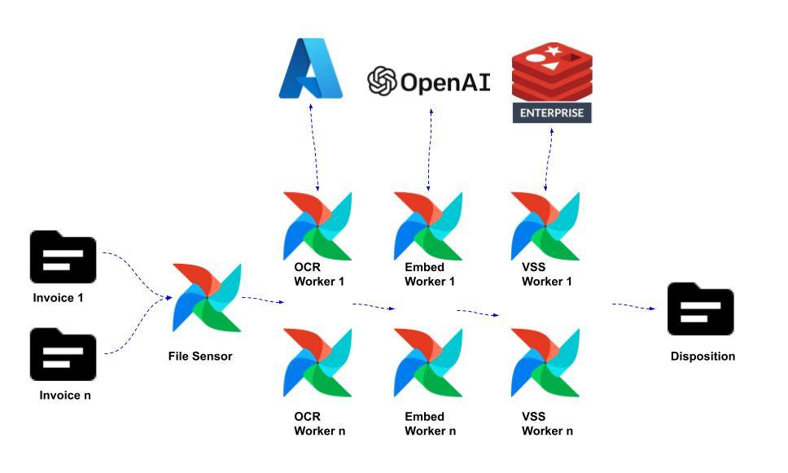
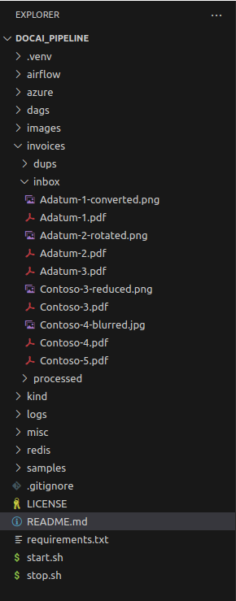
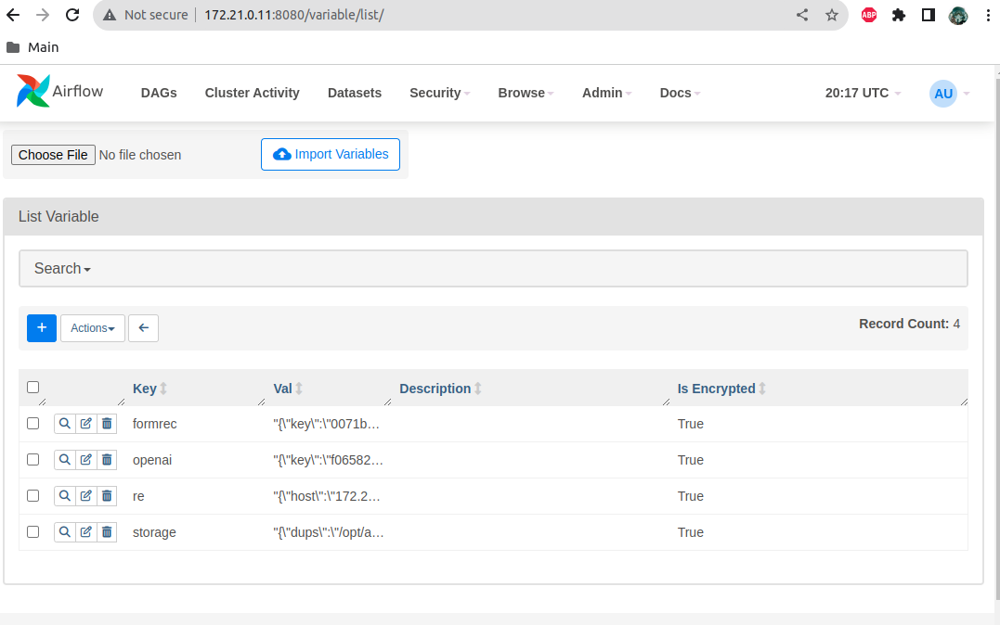
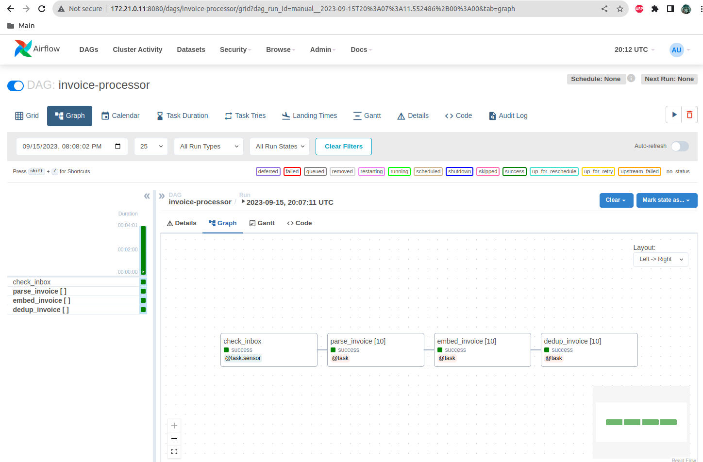
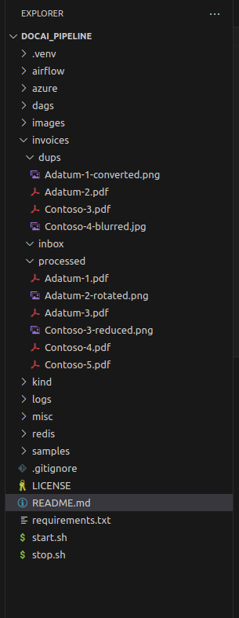

# Invoice De-duplication Demo

## Contents
1.  [Summary](#summary)
2.  [Features](#features)
3.  [Prerequisites](#prerequisites)
4.  [Installation](#installation)
5.  [Usage](#usage)
6.  [Architecture](#architecture)
7.  [Task Flow](#flow)
8.  [Results](#results)


## Summary <a name="summary"></a>
This is a demonstration of duplication detection of invoice documents.  This leverages Apache Airflow to create a task flow that performs the following:
- Local file deposit triggering of workflow
- OCR of a given invoice file via Azure Form Recognizer
- Embedding of OCR output via Azure OpenAI
- De-duplication via Redis Vector Similarity Search (VSS)

## Features <a name="features"></a>
- Kubernetes architecture (local - Kind) 
- Redis Enterprise: 3 node cluster
- Apache Airflow-managed workflow (Dag)
- Azure Document Intelligence form parsing (Form Recognizer)
- Azure OpenAI embedding
- Redis vector/metadata storage + search (VSS)

## Prerequisites <a name="prerequisites"></a>
- kind
- kubectl
- docker
- azure cli
- azure account

## Installation <a name="installation"></a>
```bash
git clone https://github.com/Redislabs-Solution-Architects/docai_pipeline.git && cd docai_pipeline
```
- Note 1:  This is scripted to be fully-automatic; however, the first usage of Azure's Document Intelligence API(s) requires a manual step of building a resource/deployment and then accepting their AI-usage terms.
- Note 2:  Apache Airflow will be writing to the local 'invoices' directory.  Airflow operates with a uid of 50000 and gid of 0 (root).  You will need to change the group of the dags, invoices, and logs directories such that Airflow has access to them.
```bash
sudo chgrp -R root dags
sudo chgrp -R root invoices
sudo chgrp -R root logs
```

## Usage <a name="usage"></a>
### Start
#### Kubernetes Environment Build Out
```bash
./start.sh
```
#### DAG Trigger
The Invoice DAG is currently set with no schedule.  This is form demo purposes.  In a normal setting this DAG would be scheduled for hourly or daily execution.  Use Admin UI to manually start the DAG via the 'Trigger DAG' button.  Username: admin  Password: admin



### Stop
```bash
./stop.sh
```

## Architecture <a name="architecture"></a>
  

## Task Flow <a name="flow"></a>
 

## Results <a name="results"></a>
### Input Dataset
There are total of 10 sample invoices.  Four are duplicates.
- Adatum-1-converted.png:  File format conversion of Adatum-1 (PDF to PNG)
- Adatum-2-rotated.png:  Format conversion and 90 degree rotation of Adatum-2
- Contoso-3-reduced.png:  Format conversion and size reduction of Contoso-3.
- Contoso-4-blurred.jpg:  Format conversion and blurring of Contoso-4.

 

### Airflow Variables


### Airflow Status
 

### Invoice File Dispositions
 

